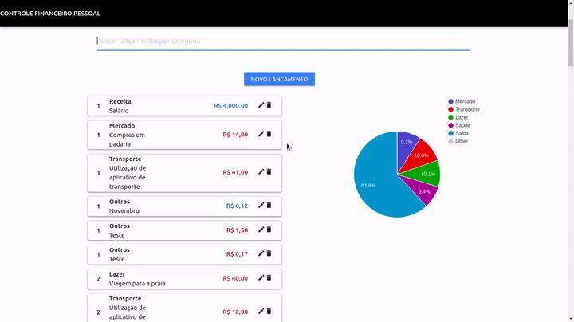

# personal-finance-app

An app to help you with the management of your personal finances. You can record and analize with graphs your monthly incomings and outgoings.

_As an study application, this source code has a lot of comments, like a copybook, to help me with some things that I learned during the development process._

# Preview



# Technologies

- JavaScript
- Node
- React
- Express
- Axios
- React google charts
- MongoDB
- Mongoose

# Prerequisites

To run this project, you will need to have Git, React, Node and MongoDB installed in your machine.

# Installing

- Clone this repository
  ```
  git clone https://github.com/RubensMario/personal-finapp
  ```

## Backend

- Go to the root directory of the project:
  ```
  cd app
  ```
- Install the dependencies:

  ```
  yarn

  ```

- Start the server
  ```
  yarn start
  ```

## Frontend

- Go to the client folder:
  ```
  cd client
  ```
- Install the dependencies:
  ```
  yarn
  ```
- Start the app
  ```
  yarn start
  ```

# Author

Rubens Mario

# Acknowledgments

This project was developed as the IGTI fullstack web developer final challange.
